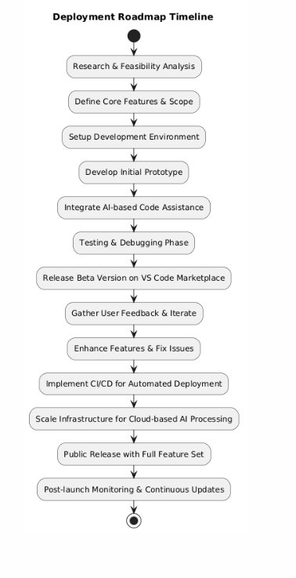
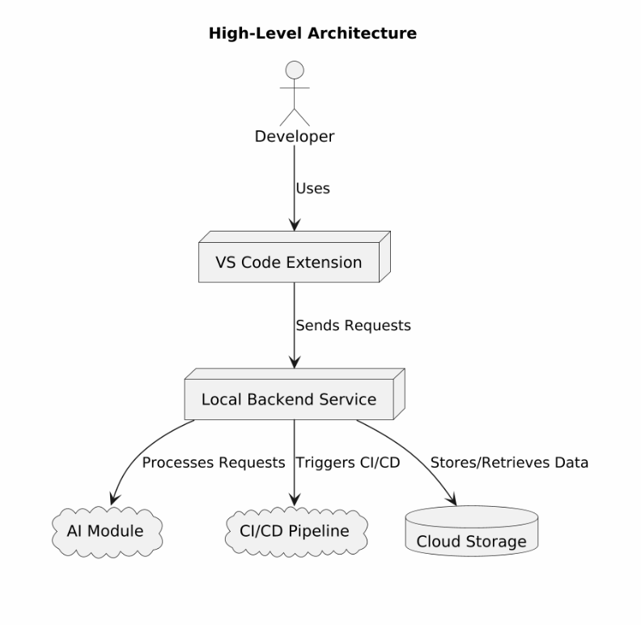
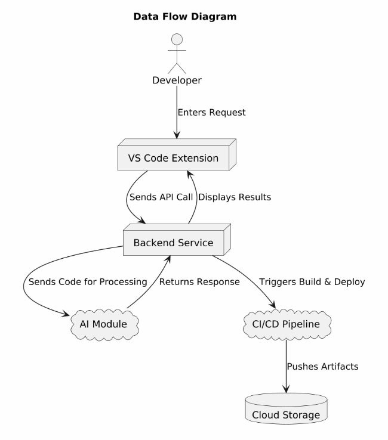

# AI-Powered Smart IDE Assistant

## Overview

We are developing an **AI-Powered Smart IDE Assistant** that transforms the development experience within VS Code by integrating intelligent code generation, automated testing, advanced debugging, and CI/CD automation into one seamless environment. This solution streamlines repetitive tasks—such as debugging, writing boilerplate test cases, and managing deployment pipelines—so developers can focus on creativity and innovation.

**How Our Solution Stands Out:**

🔹 **Comprehensive Functionality**
Unlike existing tools that offer basic code autocompletion, this AI-powered assistant harnesses advanced LLMs (e.g.,  **GPT-4, CodeLlama** ) to transform  **natural language into functional code** , detect and fix  **errors in real time** , and  **automatically generate unit tests** —all within a single, streamlined platform.

⚡ **Enhanced Productivity**
By  **automating key development tasks** , this solution significantly reduces the time spent on debugging and testing. Studies show that  **AI-assisted coding can improve task completion times by up to 55%** , and this tool takes it a step further by integrating **CI/CD automation** for even  **faster, error-free deployments** .

🔗 **Seamless Integration**
Built as a  **VS Code extension** , the assistant seamlessly fits into existing developer workflows. With an  **intuitive, interactive interface** , it provides **smarter, faster, and more reliable** coding assistance than conventional IDE plugins.

📈 **Future-Ready Approach**
Backed by  **cutting-edge research and real-world data** , this solution is designed to  **evolve with the industry** , ensuring it **meets current developer needs** while remaining **scalable and adaptable** for future challenges. It’s not just another coding tool—it’s an **AI-powered revolution in software development.**

---

## Problem Statement

Developers often find themselves bogged down by time-consuming tasks such as:

🔍 **Repetitive Debugging** – Fixing errors over and over again. 

🧪 **Writing Redundant Test Cases** – Manually creating similar test scenarios.

⚙️ **Managing Complex CI/CD Pipelines** – Handling deployments without automation.

These inefficiencies result in wasted hours that could be redirected toward innovative coding and faster product delivery. Our solution targets these pain points, aiming to boost productivity and enhance code quality while reducing developer frustration.

---

## **Key Features:**

✔ **AI-Powered Code Generation**
Leverages advanced LLMs like **GPT-4** and **CodeLlama** to transform natural language instructions into  **optimized, production-ready code** , reducing development time and effort.

✔ **Intelligent Debugging & Automated Testing**
Identifies and resolves errors  **in real time** , automatically generates  **comprehensive unit tests** , and enhances code quality with minimal manual intervention.

✔ **Seamless CI/CD Automation**
Integrates **automated testing and deployment pipelines** directly within the development workflow, ensuring **faster, error-free releases** without the overhead of manual CI/CD management.

✔ **Deep VS Code Integration**
Designed to function  **natively within VS Code** , providing an intuitive, efficient experience that enhances productivity  **without disrupting existing workflows** .

---

## Technologies & Components :

🔹 **VS Code Extension (Frontend)**
   	 ▪ **Languages:** JavaScript/TypeScript
   	 ▪ **Tools:** VS Code Extension API
    	 ▪ **Purpose:** Provides a smooth, interactive UI for AI-powered assistance.

🔹 **Local Backend Service**
    	▪ **Language:** Python
    	▪ **Frameworks:** FastAPI or Django
    	▪ **Purpose:** Acts as the bridge between the VS Code extension and the AI module.

🔹 **AI Module**
    	▪ **Models:** OpenAI GPT-4, CodeLlama, or Hugging Face Transformers
    	▪ **Purpose:** Processes natural language requests to generate code, debug errors, and create tests.

🔹 **CI/CD Integration**
    	▪ **Tools:** GitHub Actions or Jenkins
    	▪ **Purpose:** Automates testing and deployment workflows.

🔹 **Cloud & Scaling**
    	▪ **Hosting:** AWS (EC2 or Lambda)
    	▪ **Scaling Parameters:** Designed to handle up to **1,000 requests per second** during peak usage.

---

## Deployment Roadmap

Our deployment plan is structured into clear phases:

1. **Research & Prototyping:**
   * Conduct in-depth research and define core features.
   * Develop an initial prototype.
2. **Beta Release:**
   * Launch the beta version on the VS Code Marketplace to gather early user feedback.
3. **Iterative Improvement:**
   * Refine features based on feedback and fix issues.
4. **CI/CD & Scalability:**
   * Integrate automated CI/CD pipelines and scale infrastructure using cloud services.
5. **Public Release:**
   * Roll out the full feature set publicly with continuous monitoring and updates.

**Diagram: *Deployment Roadmap Timeline* – A PlantUML diagram to visualize the phases.**

---

## References & Appendices

**References:**

* [The Impact of AI on Developer Productivity: Evidence from GitHub Copilot](https://arxiv.org/pdf/2302.06590)
* [GitHub Copilot – Your AI Pair Programmer](https://github.com/features/copilot)
* [AI-Powered Coding Funding Trends, Financial Times](https://www.ft.com/content/4868bd38-613c-4fa9-ba9d-1ed8fa8a40c8)

**Public Datasets:**

* **GitHub Public Repositories:** Filtered dataset (e.g., 159GB of Python code from 54M repositories).
* **Stack Overflow Developer Survey:** Insights into developer workflows and challenges.

## **Supporting Diagrams:**

## 1. High-Level Architecture Diagram

This diagram provides an overview of how different components interact in the  **AI-Powered Smart IDE Assistant** . The **developer** uses the  **VS Code extension** , which sends requests to the  **local backend service** . The backend processes these requests by leveraging the **AI module** for code generation, debugging, and testing. Additionally, the **backend integrates with the CI/CD pipeline** to automate testing and deployment while storing necessary data in  **cloud storage** , ensuring seamless and efficient development.

  

### **2. Data Flow Diagram:**

The data flow diagram outlines how user requests move through the system. When a **developer** enters a request (e.g., code generation or debugging), the **VS Code extension** forwards it to the  **backend service** , which then queries the **AI module** for intelligent processing. The AI module returns the processed response to the backend, which forwards it to the  **extension for display** . If required, the **CI/CD pipeline** is triggered for automation, and the **cloud storage** is used for storing deployment artifacts or logs.

---

## Future ideas to enhance the project and delve deeper:

**🔸Multi-IDE Support:**

Existing AI assistants are predominantly available for VS Code. Although some tools offer limited support for JetBrains or Neovim, our approach is to create a **unified extension** that works seamlessly across multiple IDEs. This would allow for shared context and consistent AI insights regardless of the environment, enabling developers to switch platforms without losing functionality.

🔸**Advanced AI Features:**

Current solutions like GitHub Copilot primarily focus on code autocompletion and basic error detection. We propose to push the envelope by incorporating  **real-time collaborative coding** ,  **context-aware refactoring suggestions** , and **predictive error analysis** that not only detects issues but also anticipates potential pitfalls. By leveraging continuous learning from diverse codebases, our tool could provide proactive recommendations that adapt to both individual and team coding styles.

🔸**Web-Based Interface:**

While cloud-based IDEs like Replit and CodeSandbox exist, our innovation lies in developing a **dedicated web app** that offers interactive circuit simulation of code workflows. This interface would allow developers to visualize execution flows, monitor performance in real time, and even simulate code changes in a dynamic environment—features that go beyond current offerings.

---

 This README provides a comprehensive overview of my project, explaining the problem, solution, key features, technologies, deployment roadmap, and future work.
